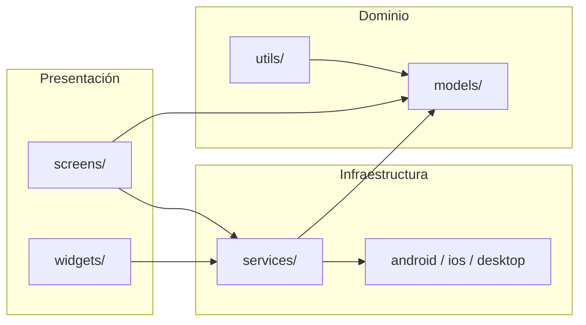
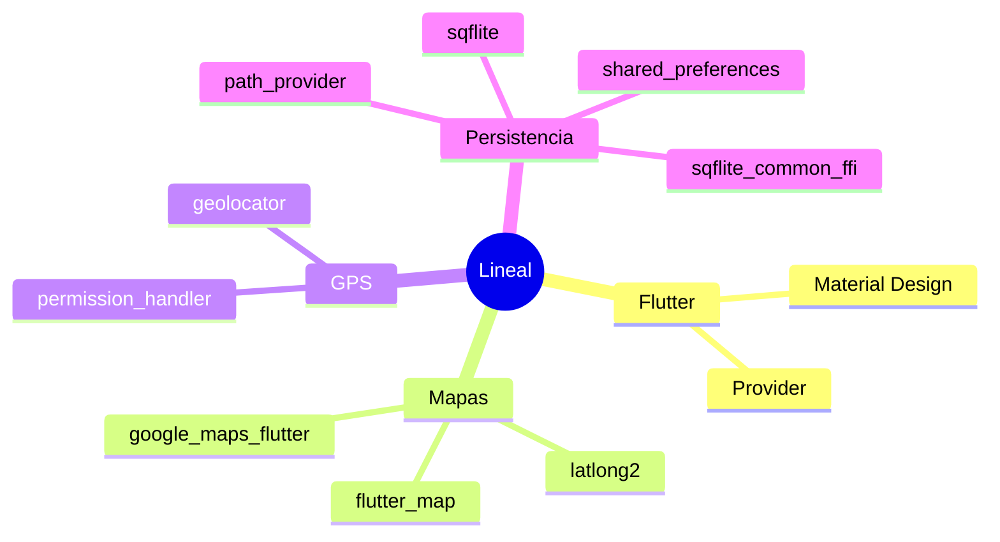
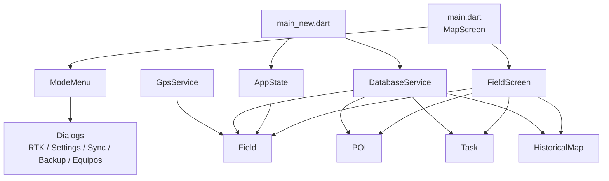
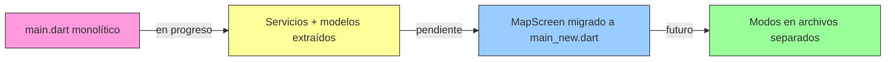

# Arquitectura

## Capas de la aplicación



## Stack tecnológico



## Estructura de `lib/`

```
lib/
├── models/
│   ├── field.dart
│   ├── poi.dart
│   ├── task.dart
│   └── historical_map.dart
├── services/
│   ├── database_service.dart
│   ├── gps_service.dart
│   └── app_state.dart
├── screens/
│   └── field_screen.dart
├── widgets/
│   ├── mode_menu.dart
│   └── dialogs/
│       ├── rtk_dialog.dart
│       ├── settings_dialog.dart
│       ├── cloud_sync_dialog.dart
│       ├── equipos_dialog.dart
│       └── backup_dialog.dart
├── utils/
│   └── validators.dart
├── main.dart          # Entrada actual (MapScreen monolítico)
├── main_new.dart      # Entrada refactorizada (en progreso)
└── field_screen.dart  # Re-exports de compatibilidad
```

## Diagrama de componentes



## Responsabilidades de servicios

| Servicio | Responsabilidad |
|----------|-----------------|
| `DatabaseService` | CRUD, migraciones, índices, FFI desktop |
| `GpsService` | Stream de posición, distancias, áreas, bearing, desviación |
| `AppState` | Campo actual, RTK, unidades, sync (ChangeNotifier) |

## Estado de la refactorización



- **Hecho:** modelos, servicios, widgets, validadores, `main_new.dart` (esqueleto)
- **Pendiente:** migrar lógica de `MapScreen` desde `main.dart` (~3350 líneas)
