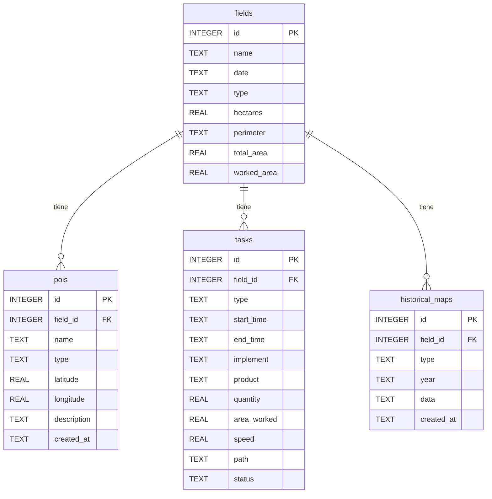
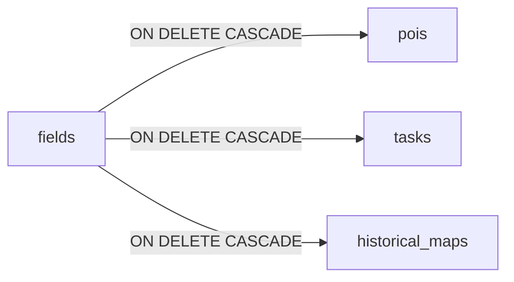
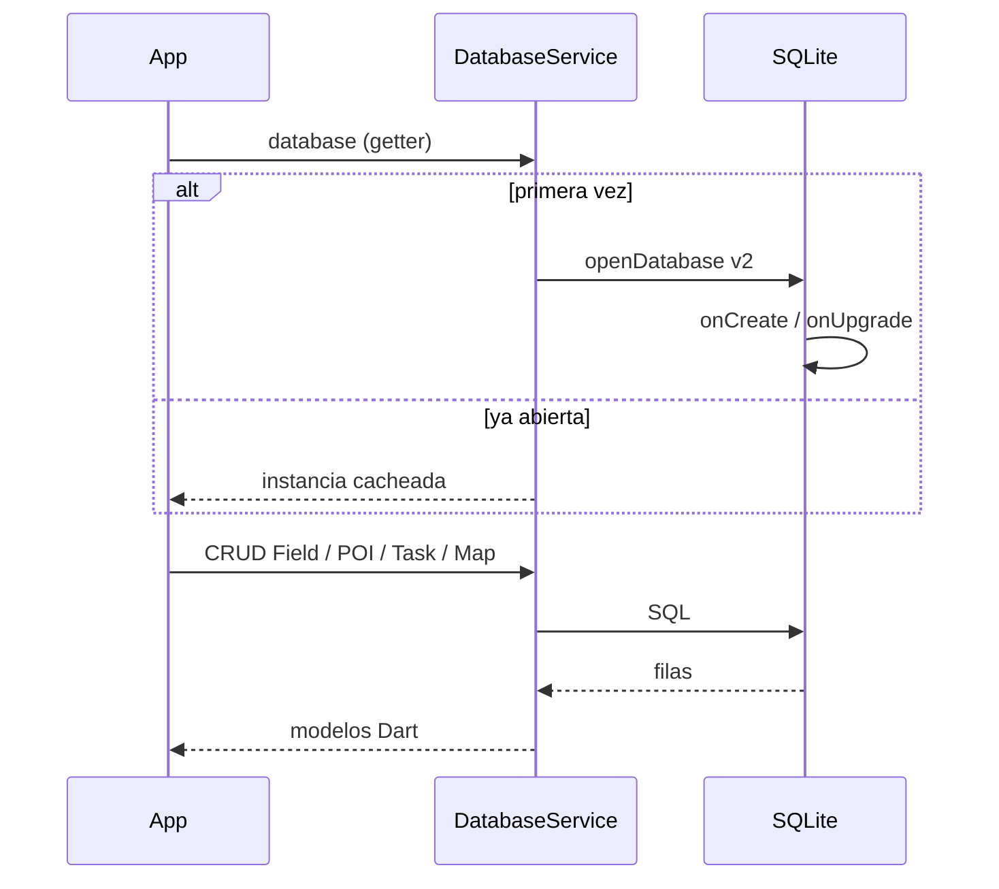
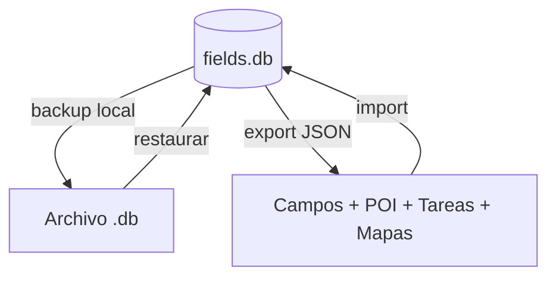

# Base de datos

SQLite local (`fields.db`, versión de esquema **2**), con soporte desktop vía `sqflite_common_ffi`.

## Modelo entidad-relación

## Tablas

### `fields`
Campos agrícolas con perímetro (JSON de coordenadas), área total y área trabajada.

### `pois`
Puntos de interés por campo. Tipos típicos: obstáculo, muestreo, referencia.

### `tasks`
Registro de trabajos (arado, siembra, pulverización, cosecha) con path GPS y métricas.

### `historical_maps`
Capas históricas (rendimiento, prescripción, humedad) por año.

## Índices

| Índice | Tabla | Columna |
|--------|-------|---------|
| `idx_fields_name` | fields | name |
| `idx_pois_field_id` | pois | field_id |
| `idx_tasks_field_id` | tasks | field_id |
| `idx_historical_maps_field_id` | historical_maps | field_id |

## Integridad referencial

Al eliminar un campo se eliminan POIs, tareas y mapas históricos asociados.

## Ciclo de vida

## Backup y sync

