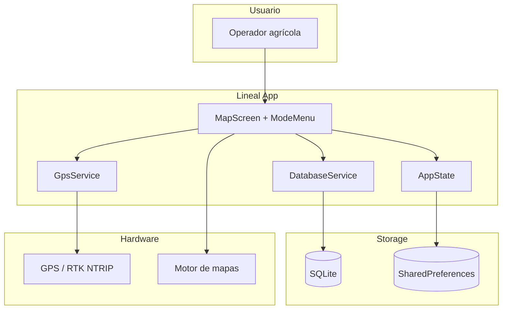
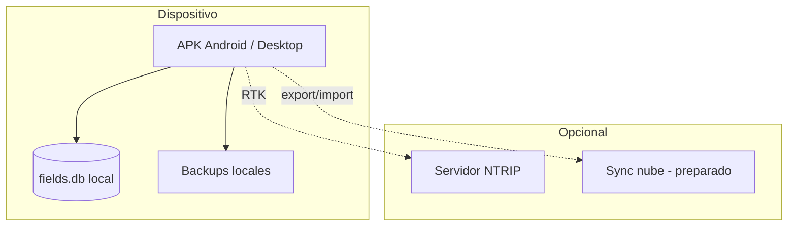

# Diagramas

Índice de diagramas Mermaid de la documentación Lineal. Se renderizan automáticamente en GitHub.

| Diagrama | Ubicación |
|----------|-----------|
| Vista rápida de arquitectura | [index.md](../index.md) |
| Capas y componentes | [arquitectura.md](../arquitectura.md) |
| Stack (mindmap) | [arquitectura.md](../arquitectura.md) |
| Estado del refactor | [arquitectura.md](../arquitectura.md) |
| ER / esquema SQLite | [base-de-datos.md](../base-de-datos.md) |
| CASCADE y ciclo de vida DB | [base-de-datos.md](../base-de-datos.md) |
| Backup / sync | [base-de-datos.md](../base-de-datos.md) |
| Mapa de modos | [modos.md](../modos.md) |
| Estados guianza A-B | [modos.md](../modos.md) |
| Secuencia perímetro | [modos.md](../modos.md) |
| Estados de tarea | [modos.md](../modos.md) |
| Jornada agrícola | [flujos.md](../flujos.md) |
| Guianza + desviación | [flujos.md](../flujos.md) |
| Section Control | [flujos.md](../flujos.md) |
| Plataformas y mapas | [flujos.md](../flujos.md) |

## Diagrama consolidado del sistema

## Diagrama de despliegue

