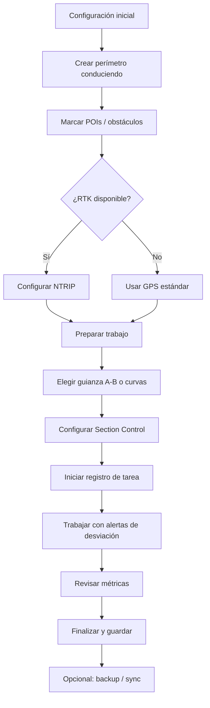
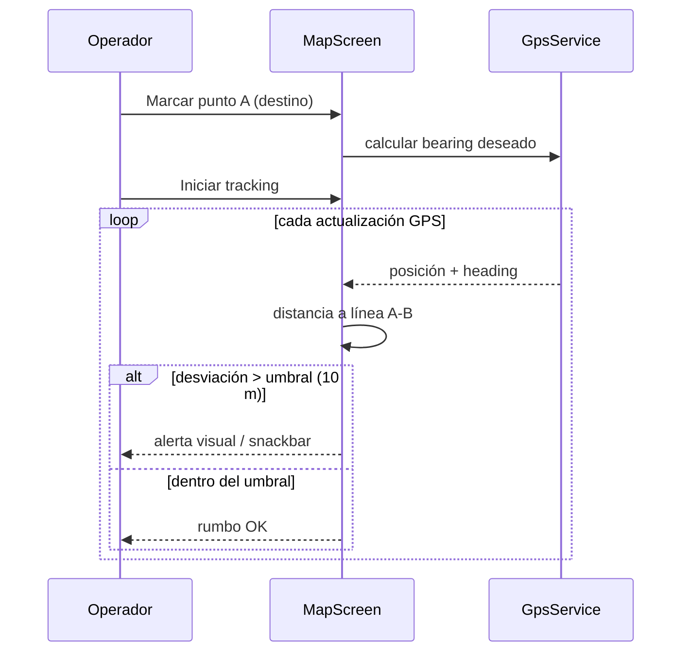
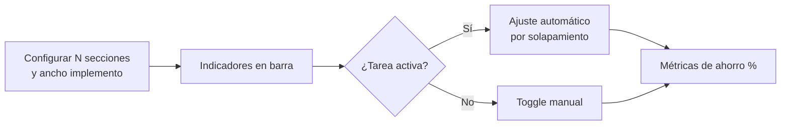
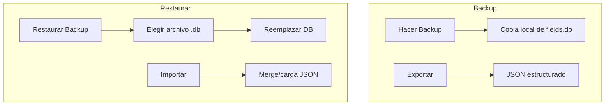
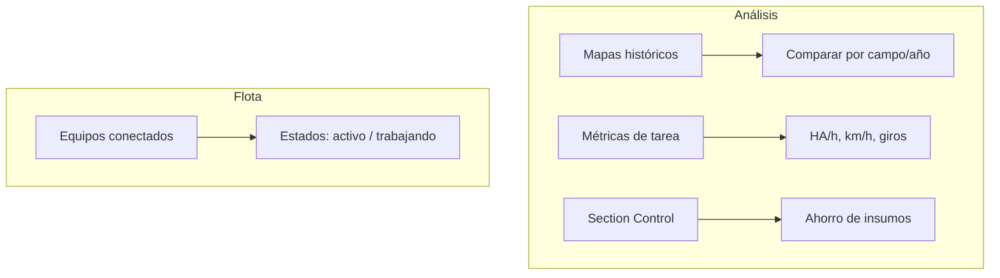
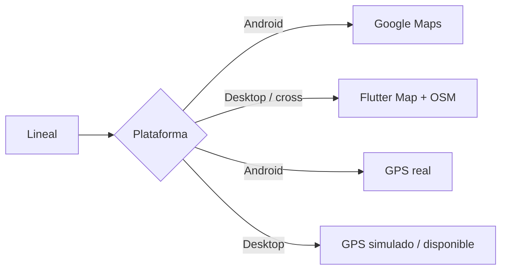

# Flujos de uso

## Flujo típico de jornada agrícola

## Flujo de guianza con desviación

## Flujo Section Control

## Flujo backup / restauración

## Gestión avanzada

## Plataformas y mapas

