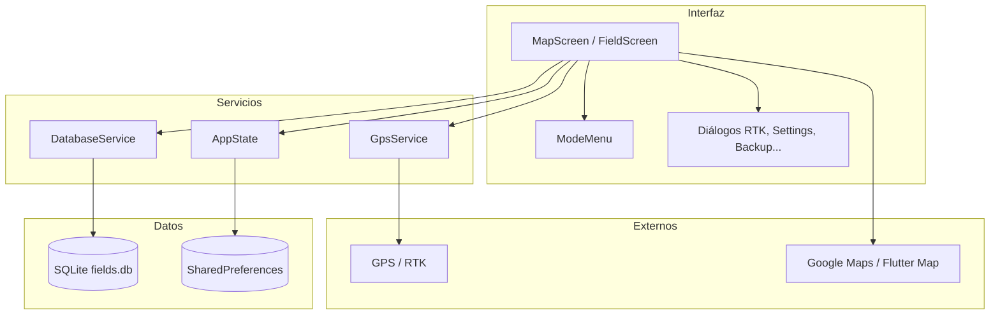

# Documentación Lineal

Aplicación Flutter de agricultura de precisión: guianza GPS, gestión de terrenos, control de implementos y análisis de datos.

| Documento | Descripción |
|-----------|-------------|
| [Guía de usuario](guia-usuario.md) | Funcionalidades, modos, instalación y soporte |
| [Arquitectura](arquitectura.md) | Capas, stack técnico y estructura del código |
| [Base de datos](base-de-datos.md) | Esquema SQLite, entidades y relaciones |
| [Modos de operación](modos.md) | Menú, categorías y diagramas de modos |
| [Flujos de uso](flujos.md) | Casos de uso y flujos operativos |
| [Mejoras implementadas](mejoras.md) | Refactor de modelos, servicios y widgets |
| [Diagramas](diagramas/README.md) | Índice de todos los diagramas Mermaid |

## Resumen técnico

| Ítem | Valor |
|------|-------|
| Framework | Flutter (Dart ^3.8) |
| Plataformas | Android, Windows, Linux, macOS |
| Persistencia | SQLite (`sqflite` + `sqflite_common_ffi`) |
| Mapas | Google Maps (Android) + Flutter Map |
| GPS | Geolocator + Permission Handler |
| Estado | Provider (`AppState`) |
| Licencia | Apache License 2.0 |
| Versión | 1.0.0+1 |

## Vista rápida de la arquitectura

## Licencia

Apache License 2.0 — ver [LICENSE](LICENSE) en la raíz del repositorio.
