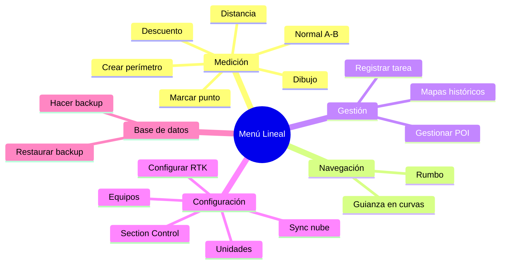
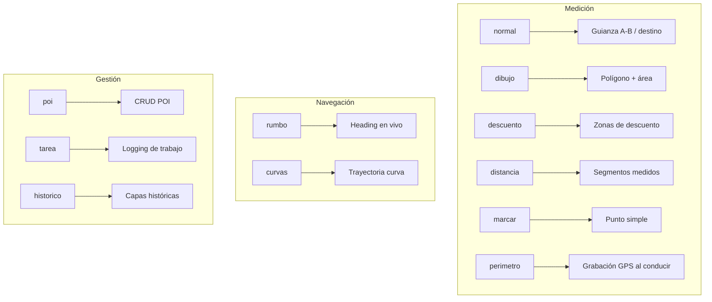
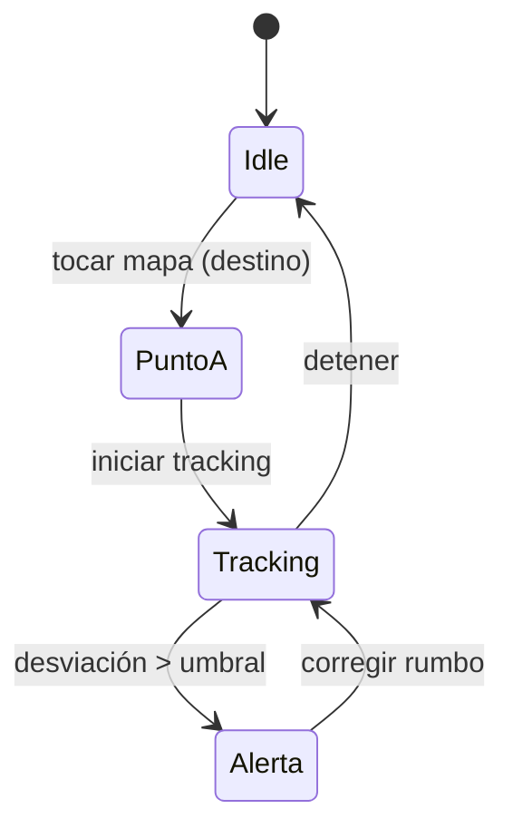
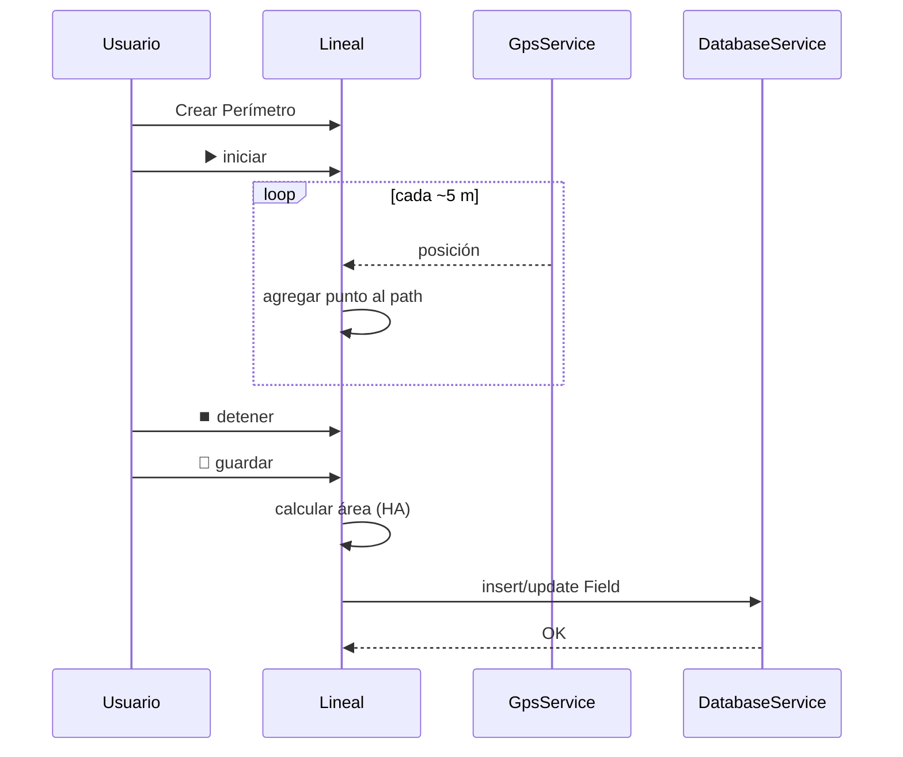
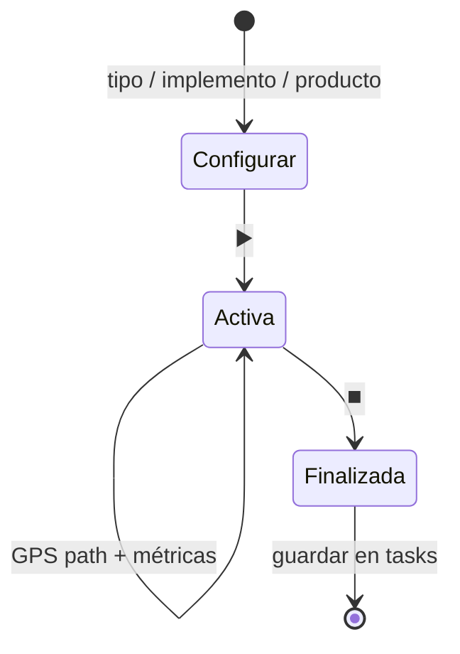

# Modos de operación

El menú lateral (`ModeMenu`) organiza los modos en cinco categorías.

## Mapa de modos

## Relación modo → acción

## Guianza A-B (modo normal)

## Creación de perímetro

## Registro de tarea

## Códigos internos (`onModeSelected`)

| Código | Modo |
|--------|------|
| `normal` | Modo Normal |
| `dibujo` | Modo Dibujo |
| `descuento` | Modo Descuento |
| `distancia` | Modo Distancia |
| `marcar` | Marcar Punto |
| `perimetro` | Crear Perímetro |
| `rumbo` | Modo Rumbo |
| `curvas` | Guianza en Curvas |
| `poi` | Gestionar POI |
| `tarea` | Registrar Tarea |
| `historico` | Mapas Históricos |
| `section` | Section Control |
| `rtk` | Configurar RTK |
| `cloud` | Sincronización Nube |
| `equipos` | Equipos Conectados |
| `settings` | Configuración |
| `backup` | Hacer Backup |
| `restore` | Restaurar Backup |
